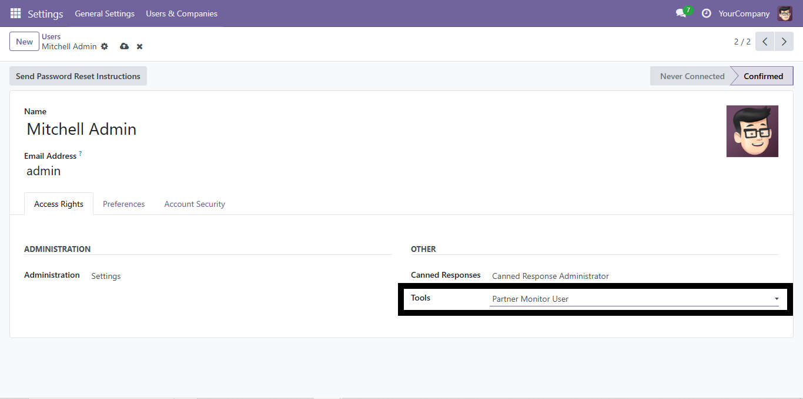
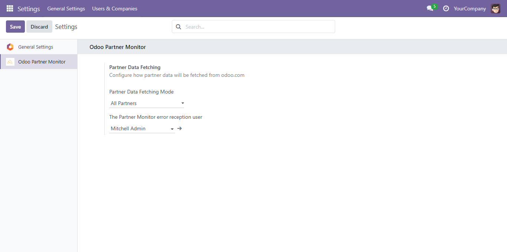
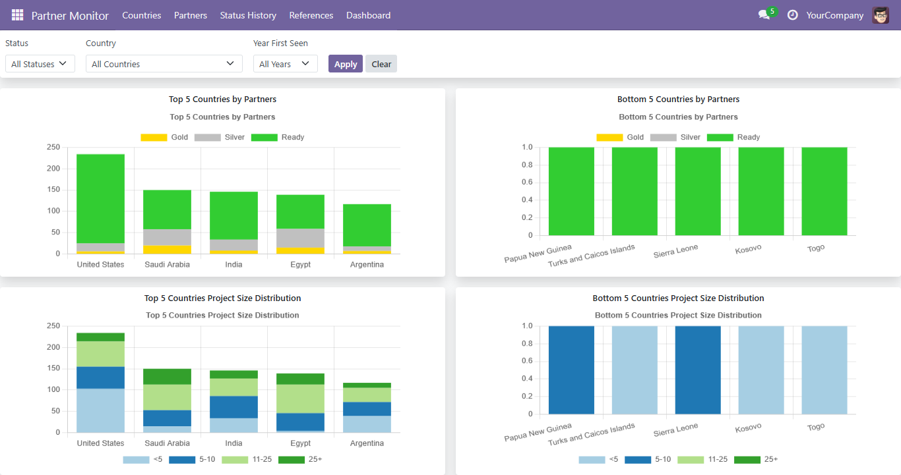
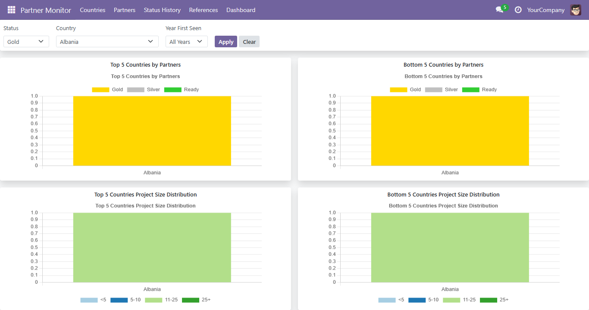
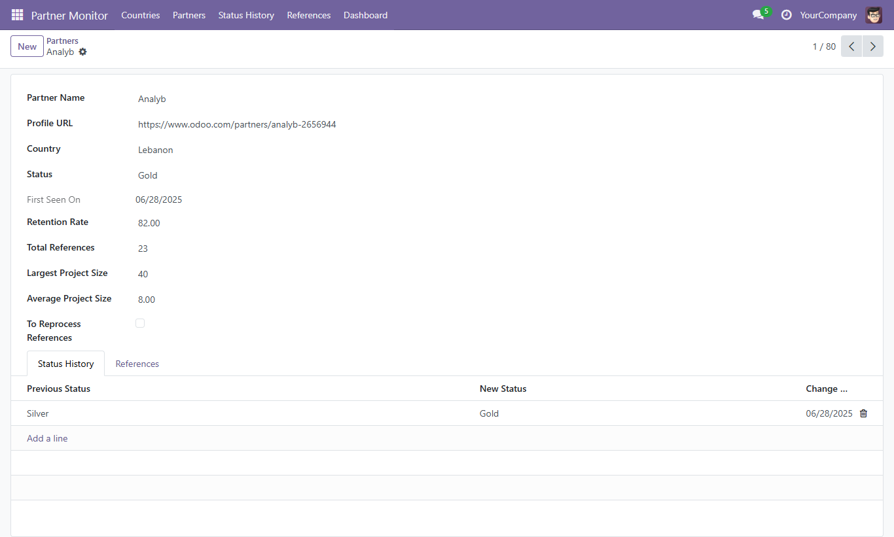
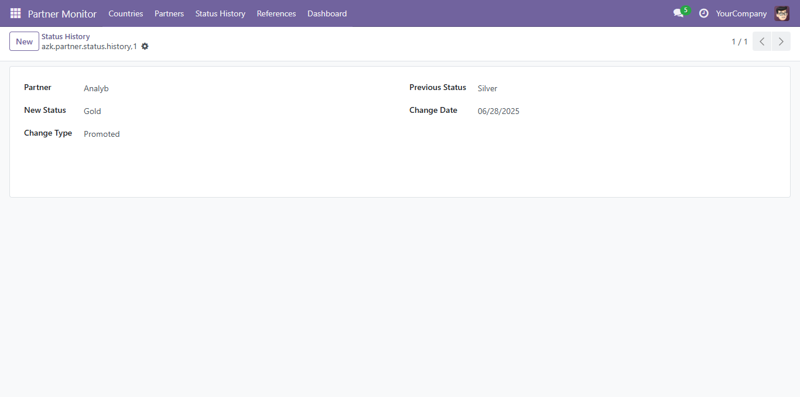

# AZK Odoo Partner Monitor

An advanced Odoo 18.0 Community module that scrapes official Odoo partners from [odoo.com](https://www.odoo.com/partners), stores their data, tracks status and reference history, and visualizes trends in a modern OWL-based dashboard.


## 🚀 Module Features

- **Partner Scraping Engine**:
  - Collects partner data from Odoo.com (supports all/specific countries and pages).
  - Extracts: name, profile URL, status (gold/silver/ready), country, reference count, retention rate, largest & average project sizes.

- **Resilient Data Design**:
  - Partners are tracked with reference and status history.
  - Automatic detection of reference count changes.
  - Automatic reprocessing of flagged partners and countries.

- **Advanced Cron Jobs**:
  - `fetch_partner_data`: main scraper (multi-threaded, resilient to layout changes,retry when fail).
  - `cron_validate_partners`: flags partners for reprocessing when reference count mismatches.
  - `cron_reprocess_flagged_partners`: re-scrapes flagged partners from profile pages.
  - `cron_validate_countries`: detects country count mismatch.
  - `cron_reprocess_flagged_countries`: re-scrapes a specific country if flagged.

- **Interactive OWL Dashboard**:
  - 4 charts: top/bottom 5 countries by partners & project size distribution.
  - Filters: by status, country, and year first seen.
  - Charts built using Chart.js.

---

## 🧩 Installation

### Prerequisites

- Odoo 18.0 Community
- Python 3.10+
- Internet access (for scraping)

### Steps

1. Clone the repo inside your custom addons path:

```bash
git clone https://github.com/majd95h/azk_odoo_partner_monitor.git
```

1. Activate developer mode in Odoo.
2. Update apps list.
3. Install the **Odoo Partner Monitor** module.
4. After installing the module, it will take 1 to 3 minutes to complete the cron.

---
## 🔐 User Access Rights

To access the **Odoo Partner Monitor**, a user must have the appropriate security rights.

### How to Grant Access:

1. Go to **Settings > Users & Companies > Users**
2. Open the user you want to grant access to.


Without this access, the user will not be able to view or interact with the dashboard or related models.
## ⚙️ Configuration

In **Settings > Odoo Partner Monitor > Partner Data Fetching**:

| Key | Value |
|-----|-------|
| `azk_odoo_partner_monitor.partner_fetch_mode` | `all`, `first`, `specific`, or `specific_c` |
| `azk_odoo_partner_monitor.partner_fetch_page` | Page number (used if `specific`) |
| `azk_odoo_partner_monitor.partner_country_id` | ID of `res.country` (used if `specific_c`) |



### 🧠 Smart Tracking
- Tracks partner status change history (`promoted`, `demoted`, `initial`)
- Logs reference count changes over time
- Flags records that need reprocessing

---

## ✅ Testing Strategy

- Manual and cron-based testing.
- Scraper validated against multiple countries and partner pages.
- Edge case handling:
  - Missing data (e.g., no project size).
  - Country slug parsing.
  - Layout shifts on Odoo.com.

### Test Scenarios

| Scenario | Result |
|----------|--------|
| Fetch all partners (country_all=1) | ✅ 100% fetched |
| Reprocess flagged partner | ✅ Rescraped correctly |
| Resilience to broken HTML or timeout | ✅ Logs error, continues |
| Dashboard filters | ✅ Dynamic chart update |
| Country page scraping | ✅ Matches partner count |

---

## 🧱 Architecture & Resilience

The design ensures reliability and future-proofing:

- **Scraper abstraction**: `_scrape_page`, `_parse_partner_card`, `_get_max_pages` encapsulate all scraping logic.
- **Layout-independent**: Uses BeautifulSoup to extract stable identifiers (e.g. class names, `span` values).
- **Threaded fetching**: Parallel requests speed up `fetch_partner_data()` without overloading.
- **Error logging**: All critical errors are logged with traceback for debugging.
- **Reprocessing flags**: Separate Boolean flags allow safe retrying.

---

## 📸 Screenshots

> Place your screenshots in `/screenshots` and embed them like:

### Dashboard Overview



### Filtered Charts



### Partner Model



### Status Model


---

## 🤖 GenAI Usage (Optional)

This project used ChatGPT for:

- Designing cron architecture
- Writing the BeautifulSoup selectors
- Markdown formatting for README


---

## 📦 Packaging & Maintainability

- Single module: `azk_odoo_partner_monitor`
- Organized into models, views, static, and dashboard structure.
- Fully uninstallable and reinstallable.
- No external dependencies beyond `requests` and `bs4` (built-in for Odoo setups).

---

## 🕒 Time Estimate

| Task | Time    |
|------|---------|
| Scraper & models | ~10 hrs |
| Dashboard + OWL/Chart.js | ~4 hrs  |
| Testing & cron jobs | ~10 hrs  |
| Documentation | ~30 min |

---

## 📄 License

This module is licensed under the LGPL-3.0 License.

## 👥 Author

Developed by [Majd] at [Azkatech](https://www.azkatech.com)  
Email: [majdhsien1@gmail.com]